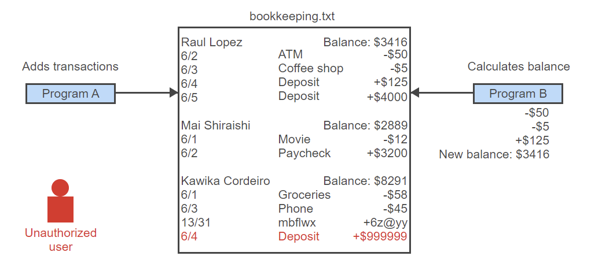
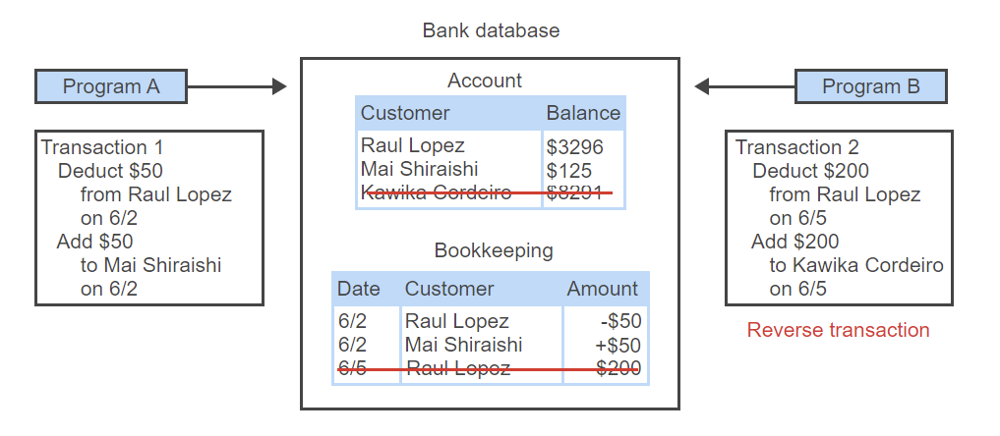
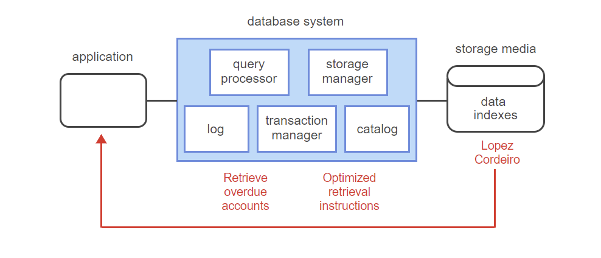

# File systems and Database Systems

- small databases shared by one or two users can be in text file or spreadsheet
- large databases that are shared by many users have more requirements
## Large Database Requirements

- *Performance:*
		- when many users and apps simultaneously access large databases query response degrades
		- systems maintain fast response by structuring data properly on storage media and processing queries efficiently
- *Authorization:*
		- database users should have limited access to specific tables, columns, or rows
		- systems authorize individual users access to specific data
- *Security:*
		- systems ensure authorized users only access permissible data
		- systems protect against hackers by encrypting data and restricting access
- *Rules:*
		- systems ensure data is consistent with structural and business rules
		- i.e. multiple copies of data stored in diff locations must be synchronized updated
		- i.e. course number appears in student reg record must exist in course catalog
- *Recovery:*
		- systems occasionally fail
		- systems must recover and restore database to consistent stat without data loss

# Transactions

- a group of queries that must be completed or rejected as whole
- executing some queries and not others results in inconsistent and incorrect data
- i.e. if bitcoin transaction sent query goes through, but the receive query does not, the bitcoin is lost
## Requirements for Processing Transactions

- *Ensure transactions are processes completely or not at all:*
		- when process fails database must reverse partial results and restore to values prior to transaction
- *Prevent conflict between concurrent transactions:*
		- multiple transactions access same data at time causes conflict
		- i.e. seat selected on flight; another person purchases before transaction completes; first person sees seat unavailable at purchase
- *Ensure transaction results are never lost:*
		- when transactions completes , results must be saved to storage media, regardless of comp or app failures

# Architecture

- describes internal components and relationship between components
## Components of Most Database Systems

- *Query Processor:*
		- interprets queries
		- creates a plan to modify database or retrieve data
		- returns query results to the app
		- performs query optimization to ensure most efficient instructions are executed on data
- *Storage Manager:*
		- translates the query processor instructions into low-level file-system commands that modify or retrieve data
		- uses indexes to quickly locate data
- *Transaction Manager:*
		- ensures transactions are properly executed
		- prevents conflicts between concurrent transactions
		- restores database to consistent state after transaction or system fail
		- writes log records before applying changes
		- after failure uses log records to restore database
- *Log:*
		- file containing complete record of inserts, updates, and deletes processed by database
- *Catalog (Data Dictionary):*
		- directory of tables, columns, indexes, and other database objects
		- used by other components to process and execute queries

Databases systems vary in capabilities and component details. i.e. some database systems don't support transactions so transaction manger not present. i.e. storage manager implementation depends on physical structure of data on storage media.

# Products

## Relational Database Systems

- stores data in tables, columns, and rows
		- data in column has same format
		- data in row represents a single object i.e. person, place, product, or activity
- supports Structured Query Language (SQL)
		- includes statements that read and write data
		- create and delete tables
		- administer database system
- ideal for databases that require accurate record of every transaction 
	- Ex: 
		 - banking
		 - airline reservation systems
		- student records
- not designed for big data
## NoSQL

- name means "not only SQL"
- optimized for big data
- became prevalent after 2000

| Product         | Sponsor                             | Type       | License     | DB-Engines rank   (May 2020) |
| --------------- | ----------------------------------- | ---------- | ----------- | ------------------------------- |
| Oracle Database | Oracle                              | Relational | Commercial  | 1                               |
| MySQL           | Oracle                              | Relational | Open source | 2                               |
| SQL Server      | Microsoft                           | Relational | Commercial  | 3                               |
| PostgreSQL      | PostgreSQL Global Development Group | Relational | Open source | 4                               |
| MongoDB         | MongoDB                             | NoSQL      | Open source | 5                               |
[1.3 Query Languages](1.3%20Query%20Languages.md)
