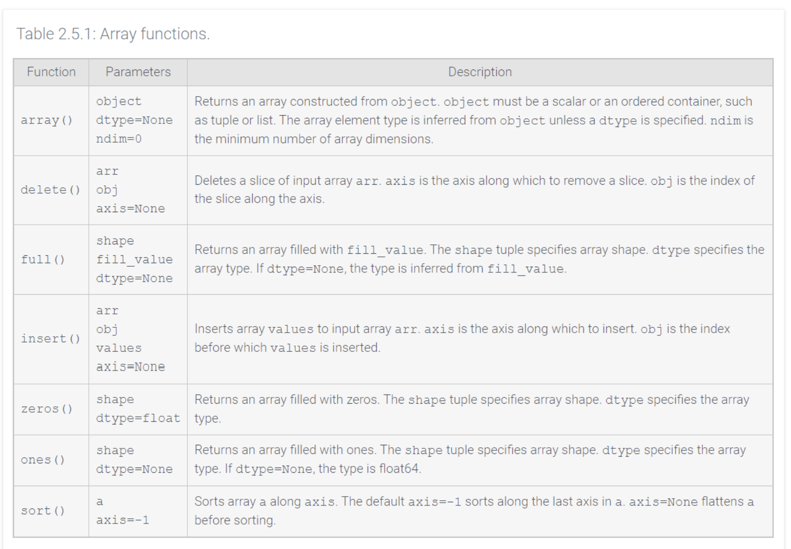

# What is NumPy?

- python package that provide mathematical functions such as polynomial computations, matrix algebra, and statistical analysis

# What is an Object?

- a single piece of data in memory
- a value that a program can store, pass around, and operate on
- generic term for "a thing the program is holding"
- in Python everything is an object
	- the number `2`
	- the text `'Braden Smith'` 
	- a list like `[2, 4, 6, 8]`
	- a NumPy array

# What is a Scalar Object

- *scalar* means "a single, standalone value"
- scalar object is one value with nothing inside it
	- `2` is one number
	- `'hello'` is one string

# What is a Container Object?

- holds other objects
- groups multiple values into one structure you can work with as a unit
	- `[2, 4, 6, 8]` a *list* container; ***Ordered, Indexed, Mutable***
	- `(2, 4)` a *tuple* container; ***Ordered, Indexed, Immutable***
	- `{'Raul': 3300, 'Mai': 2500}` a *dictionary* container; ***Key-value Pairs, Mutable***
	- `{831, 572, 290, 572}` a *set* container; ***Unordered, No Duplicates, Mutable***
- each container has different properties used to describe what kind of container it is and how it behaves
	- ***Ordered*** elements keep their sequence; what's first stays first
	- *Indexed* elements can be accessed directly by position number, starting at 0
	- ***Mutable*** contents can be changed in place after creation
	- ***Immutable*** contents can't be changed after creation; "edits" create a new object instead
	- ***No Duplicates*** each value may appear only once; repeats are automatically discarded
	- ***Key-value Pair*** data stored as label + content, retrieved by the label instead of a position

# What is a Type?

- the category or classification of an object
- it defines what kind of data the object holds and what you can do with it
	- Ex:
		- `2` has the type *integer*
		- `'hello'` has the type *string*
		- `[2, 4, 6, 8]` has the type *list*
		- a NumPy array has the type *ndarray*

# What is ndarray Type?

- an ordered, indexed, and mutable container
- elements are of any type but must be the same type
- the ndarray object is called an ***array*** and is created by the `array()` function
	- zero-dimensional array consists of a scalar object 
		- Ex: `2`
	- one-dimensional array consists of a container of scalars 
		- Ex:`[2, 4, 6, 8]`
	- two-dimensional array consists of a container of containers of scalars
		- Ex: `[ [2, 4, 6, 8], [12, 14, 16, 18] ]`
	- N-dimensional array has N levels of nested containers
		- at each level all the containers should have the same ***size*** or number of elements
		- the ***shape*** of an array is a tuple of the level sizes 
			- Ex: The shape of `[ [2, 4, 6, 8], [12, 14, 16, 18] ]` is `(2, 4)`
		- the shape tuple is stored in the `array.shape` attribute
	- array elements are accessed with index notation 
		- Ex: `array[2, 5]` returns the element in the third row and sixth column of a two-dimensional array

# Array Literals

- literal such as `[2, 4, 6, 8]` is actually a list, not an array
- formally an array literal is written as `array([2, 4, 6, 8])`

# Array Functions

Tables of functions follow several conventions:
- tables include all required parameters
	- tables also include important optional parameters
	- exclude infrequently used optional parameters
- NumPy functions are written with the prefix 'numpy' or an alias
	- the tables omit this prefix Ex: `sort(array)` stands for `numpy.sort(array)`
- many NumPy functions have equivalent `ndarray` methods Ex: `sort(array)` is equivalent to `array.sort()`
	- the tables document functions only and omit equivalent methods

- some functions have an **axis** parameter
	- axis is a dimension
	- in a two-dimensional array, axis 0 refers to rows and axis 1 refers to columns Ex: `sort(array, axis=1)` sorts column values `(axis=1)` within each row

# CRUD for NumPy

Starting from `arr = np.array([[10, 20, 30], [210, 220, 230]])`:

|CRUD|SQL statement|NumPy equivalent|Verified result|
|---|---|---|---|
|Create|`INSERT INTO ... VALUES`|`np.array([[1,2,3],[4,5,6]])` or `np.append(arr, [[40,50,60]], axis=0)`|New 3×3 array|
|Read|`SELECT ... WHERE val > 100`|`arr[arr > 100]` (boolean mask)|`[210, 220, 230]`|
|Read one row/col|`SELECT * / SELECT col`|`arr[0]` / `arr[:, 1]`|`[10, 20, 30]` / `[20, 220]`|
|Update|`UPDATE ... SET val = 0 WHERE val > 100`|`arr[arr > 100] = 0`|`[[10,20,30],[0,0,0]]` — changes in place|
|Delete|`DELETE FROM ... WHERE`|`np.delete(arr, 0, axis=0)`|`[[210, 220, 230]]` — but see below|