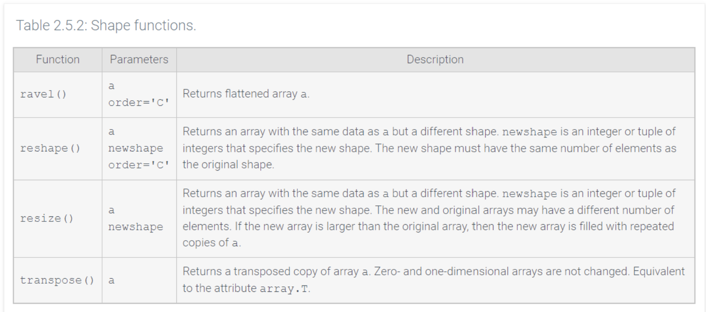

- Sometimes the shape of an array must be changed. 
	- Ex: two-dimensional data might be structured as one-dimensional in a CSV file and reading the file creates a one-dimensional array so it needs to be restructured back to two-dimensions.

# Reshaping

- changes array dimensions while retaining array data 
	- Ex: `[[1, 3, 5], [2, 4, 6]]` might be reshaped to `[[1, 2], [3, 4], [5, 6]]`
		- ***Flattening** reshapes an N-dimensional array to one dimension
		- reshaping a two-dimensional array prioritizes element order in either rows or columns
			- ***Row-major** prioritizes row order
			- ***Column-major** prioritizes column order
				- Ex: flattening `[[1, 3, 5], [2, 4, 6]]` returns:
					- `[1, 3, 5, 2, 4, 6]` in row-major order
					- `[1, 2, 3, 4, 5, 6]` in column-major order
		- row- and column-major order applies to arrays of three or more dimensions
		- row-major reshaping prioritizes element order in the first dimension, then the second, and so on
		- column-major reshaping prioritizes dimensions in reverse order

-  some shape functions have an order parameter
	- `order='C'` specifies row-major order
	- `order='F'` specifies column-major order
- `'C'` and `'F'` stand for the languages C and FORTRAN, which store arrays in row- and column-major order, respectively

