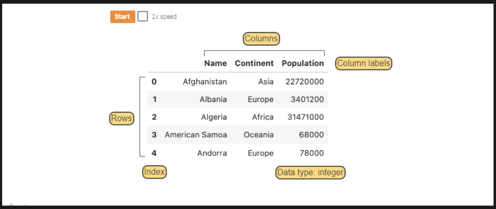

- a python package that stores and manipulates datasets
- represents datasets with the DataFrame type
# Dataframes

> [!NOTE]
> **dataframe**, in lowercase, refers to a DataFrame object 
### What is a dataframe

- consists of rows and columns
	- rows represent instances
	- columns represent features
- rows and columns are identified by integer or string **labels**
	- **index** - set of *row* labels
		- labels automatically generated integers
	- **columns** - set of *column* labels
		- labels are manually specified strings
		- all values in column must have same type
		- different columns may have different types
		- **Data Types for Columns:**
			- integer
			- float
			- string

# DataFrames vs Arrays

### Similarities Between DataFrames and Arrays

- both are indexed, ordered, mutable containers
- both represent ***axes***
	- data in multiple dimensions
- both have a ***shape***
	- a tuple of integers representing the number of elements along each axis

### Differences Between DataFrames and Arrays

#### DataFrames

- are always two-dimensional
- different columns have different types
- labels may be integers, strings, or other types
#### Arrays

- may have zero, one, or many dimensions
- all values have the same type
- indexes are integers only

# Dataset Features

- usually have string names
- often have different types
- usually implemented as dataframes in `pandas` rather than `NumPy` arrays

| Statement                                                                                           | What it does                                                                                                                                      | Result                                                                 |
| --------------------------------------------------------------------------------------------------- | ------------------------------------------------------------------------------------------------------------------------------------------------- | ---------------------------------------------------------------------- |
| `pd.DataFrame(data=[[...], [...]], columns=['Label1', 'Label2', 'Label3', 'Label4'], index=[0, 1])` | Constructs a DataFrame from a list of lists, where each inner list is one row; `columns=` names the four columns and `index=` labels the two rows | A 2×4 DataFrame stored in the variable `dataframe`                     |
| `dataframe`                                                                                         | Evaluating the variable displays the DataFrame; Jupyter renders it as a formatted HTML table                                                      | Table with rows `abc / 3.30 / 28 / True` and `xyz / -0.55 / 0 / False` |
| `dataframe.shape`                                                                                   | Attribute (not a method — no parentheses) that returns the dimensions as a `(rows, columns)` tuple                                                | `(2, 4)`                                                               |