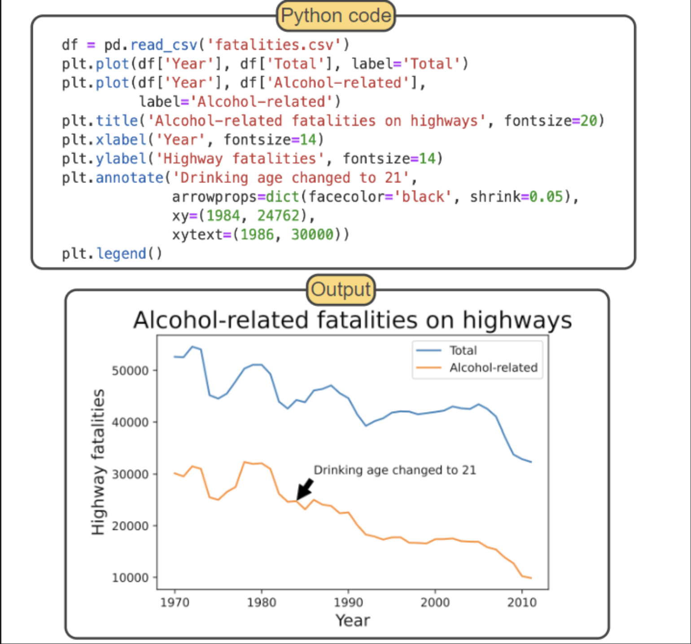

# Labeling Plots

| **Function Name**             | **What it Does**                                                             |
| ----------------------------- | ---------------------------------------------------------------------------- |
| `plt.title()`                 | - add title to a figure                                                      |
| `plt.xlabel()`                | - adds text for the x-axis                                                   |
| `plt.ylabel()`                | - adds text for the y-axis                                                   |
| `plt.text(x, y, s)`           | - adds string `s` to the figure at coordinates `(x, y)`                      |
| `plt.annotate(s, xy, xytext)` | - links string `s` at coordinates given by `xytext` to a point given by `xy` |
| `plt.legend()`                | - adds legend in the figure                                                  |
> [!Note]
> Adding mathematical expressions using LaTeX is supported. It can be done by enclosing an expression within a string with dollar signs. The letter `r` should precede a string so that a backslash is not treated as a Python escape. 
> Ex: `plt.title(r'Standard normal distrobution $f(x) = \frac{1}{\sqrt{2\pi}}e^{-\frac{1}{2}x^2}$')` 

