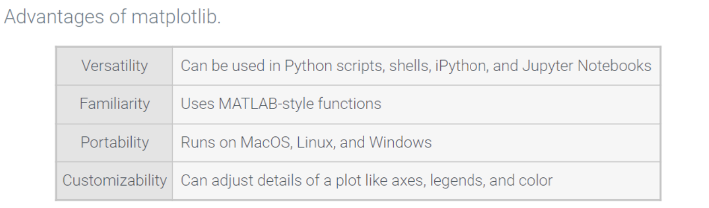

# What is`matplotlib`?

- a package used to create static, dynamic, and interactive plots
- uses figures to hold plot elements
	- axes
	- labels
	- tick marks
	- legend
- each element can be adjusted manually
	- Ex: positions of minor and major tick marks can be controlled as well as the font sizes for the labels

## What is`pyplot`Library?

- a state-based interface to the `matplotlib` package that uses a similar syntax to MATLAB
- each line of code adds a plot element to the figure one at a time, while preserving element in the figure added earlier

