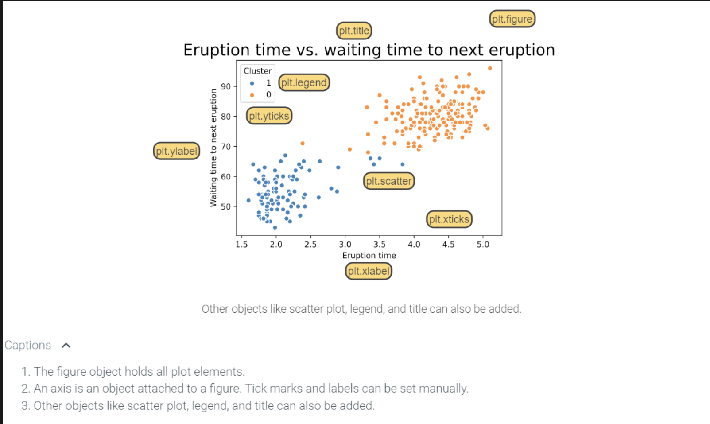

- first create a plot with `pyplot`
	- import library using dot notation
		- Ex: `import matplotlib.pyplot as plt`

### `pyplot`

- can display different objects within a figure

| **Object Name**                                                                                                             | **What it Does**                                                                                                       |
| --------------------------------------------------------------------------------------------------------------------------- | ---------------------------------------------------------------------------------------------------------------------- |
| [`plt.plot(x, y)`]((https://matplotlib.org/stable/api/_as_gen/matplotlib.pyplot.plot.html#matplotlib.pyplot.plot))          | - where `x` and `y` are arrays of the same size 	- creates a line plot connecting consecutive x- and y- coordinates |
| [`plt.scatter(x, y)`]((https://matplotlib.org/stable/api/_as_gen/matplotlib.pyplot.scatter.html#matplotlib.pyplot.scatter)) | - creates a scatter plot showing all pairs of x- and y- coordinates                                                    |
| [`plt.figure()`](https://matplotlib.org/stable/api/_as_gen/matplotlib.pyplot.figure.html#matplotlib.pyplot.figure)          | - creates a new figure                                                                                                 |
| [`plt.show()`](https://matplotlib.org/stable/api/_as_gen/matplotlib.pyplot.show.html#matplotlib.pyplot.show)                | - displays the figure and all the objects the figure contains                                                          |
| [`plt.savefig(fname)`](https://matplotlib.org/stable/api/_as_gen/matplotlib.pyplot.savefig.html#matplotlib.pyplot.savefig)  | - saves the figure in the current working directory with the filename `fname`                                          |
>[!Note] 
>`plt.figure()` is only needed when changing the default size of the figure. The size of the figure can be specified using the `figsize` parameter. Since a figure is implicitly created whenever `plt.plot(x, y)` or `plt.scatter(x, y)` functions are called, calling `plt.figure()` is not necessary if the default figure size is acceptable. The default figure size is 6.4 inches by 4.8 inches.
>
>When using Jupyter Notebooks or any other IDLE, all the elements of each figure is automatically displayed when the cell or line of code is ran so `plt.show()` is only necessary when `matplotlib` is used in a script or terminal.

#### `np.linspace()`

|Parameter|What it does|Default|
|---|---|---|
|`start`|First value in the sequence.|Required|
|`stop`|Final value, unless `endpoint=False`.|Required|
|`num`|Number of values to generate. It must be zero or greater.|`50`|
|`endpoint`|Whether to include `stop` in the result.|`True`|
|`retstep`|Whether to also return the spacing between values.|`False`|
|`dtype`|Data type of the returned array, such as `int` or `float`.|Inferred|
|`axis`|Where to insert the sample axis when `start` or `stop` is array-like.|`0`|
|`device`|Device for the created array; only `"cpu"` if used.|`None`|
- Ex: `np.linspace(-5, 5, num=100)`
	- creates a NumPy array of 100 evenly spaced numbers from -5 through 5 including both endpoints