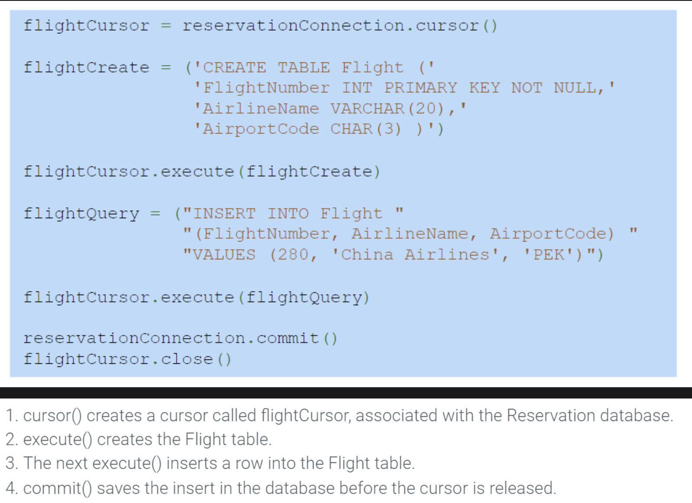
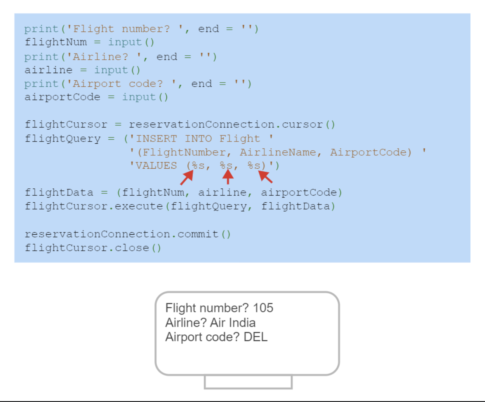
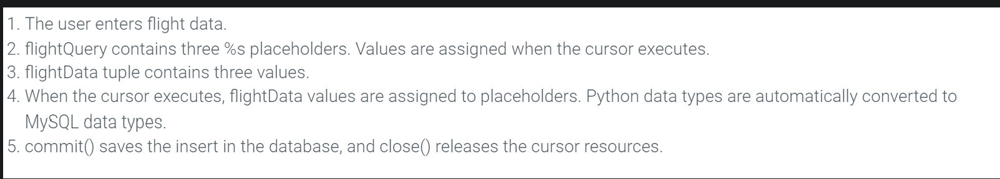

# What is a Python Cursor

-  an object of the **MySQLCursor** class

- are created with the `connection.cursor()` method

- are always associated with a specific database

- always associated with one connection but may be reused for multiple SQL statements

## MySQLCursor

- a class that executes SQL statements and stores the results

| Method/Property                                                                                                                                               | Parameters                                                                                                                                                                                                                                                                                                                                                                                                                                                                                                    | Additional Explanation                                                                                                   |
| ------------------------------------------------------------------------------------------------------------------------------------------------------------- | ------------------------------------------------------------------------------------------------------------------------------------------------------------------------------------------------------------------------------------------------------------------------------------------------------------------------------------------------------------------------------------------------------------------------------------------------------------------------------------------------------------- | ------------------------------------------------------------------------------------------------------------------------ |
| [`connection.cursor()`](https://dev.mysql.com/doc/connector-python/en/connector-python-api-mysqlconnection-cursor.html)                                       | `buffered` (bool): if `True` cursor fetches all rows from the server after an operation is executed `raw` (bool): if `True` cursor skips the conversion from MySQL data types to Python types when fetching rows `dictionary` (bool): if `True` cursor returns rows as dictionaries `prepared` (bool): if `True` cursor is used for executing prepared statements `cursor_class`: can be used to pass a class to use for instantiating a new cursor; it must be a subclass of `cursor.CursorBase` | used to create cursors                                                                                                   |
| [`cursor.execute()`](https://dev.mysql.com/doc/connector-python/en/connector-python-api-mysqlcursor-execute.html)                                             | `operation` (required) (query or command): string containing the SQL statement to run Ex: `INSERT`, `SELECT`, `UPDATE`, or `DELETE` `params` (default = `None`): tuple or dictionary of values that get bound to placeholders inside the `operation` string; if tuple is used placeholder is `%s`, if dictionary is used placeholder is `%(name)s`                                                                                                                                                         | executes SQL statements after being compiled                                                                             |
| [`cursor.close()`](https://dev.mysql.com/doc/connector-python/en/connector-python-api-mysqlcursor-close.html)                                                 | none                                                                                                                                                                                                                                                                                                                                                                                                                                                                                                          | closes the cursor, resets all results, ensures that the cursor object has no reference to its original connection object |
| [`connection.commit()`](https://dev.mysql.com/doc/connector-python/en/connector-python-api-mysqlconnection-commit.html)                                       | none                                                                                                                                                                                                                                                                                                                                                                                                                                                                                                          | commits all changes from current transaction since changes are not automatically committed                               |
| [`connection.rollback()`](https://dev.mysql.com/doc/connector-python/en/connector-python-api-mysqlconnection-rollback.html)                                   | none                                                                                                                                                                                                                                                                                                                                                                                                                                                                                                          | undoes all changes from current transaction                                                                              |
| [`cursor.rowcount`]()                                                                                                                                         | n/a (a property)                                                                                                                                                                                                                                                                                                                                                                                                                                                                                              | returns the number of rows returned for `SELECT` statements or affected by statements `INSERT` or `UPDATE`               |
| [`cursor.column_names`](https://dev.mysql.com/doc/connector-python/en/connector-python-api-mysqlcursor-column-names.html)                                     | n/a (a property)                                                                                                                                                                                                                                                                                                                                                                                                                                                                                              | returns column names of a result set as a sequence of Unicode strings                                                    |
| [`cursor.warnings()`](https://dev.mysql.com/doc/connector-python/en/connector-python-api-mysqlcursor-warnings.html) (`cursor.fetchwarnings()` was deprecated) | n/a (a property)                                                                                                                                                                                                                                                                                                                                                                                                                                                                                              | returns a list of tuples containing warnings from previous executed operation                                            |

>[!Warning]
>A database programmer must be cautious when inserting input data into an SQL statement. An **SQL injection attack** is when a user intentionally enters values that alter the intent of an SQL statement. The `cursor.execute()` method prevents SQL injection when assigning values to placeholders.

## Fetching Values

- when `cursor.execute()` executes a SELECT statem,ent the query results are accessed with fetch methods

| Methods | Parameters | Additional Explanation |
| ------- | ---------- | ---------------------- |
|         |            |                        |
