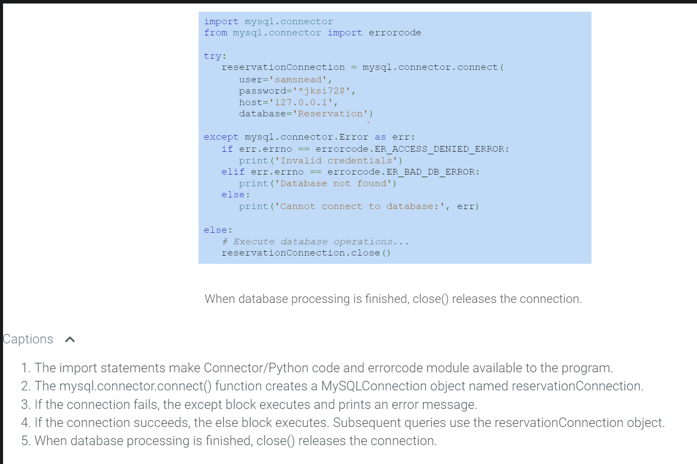

# Connections

- a connection is an object of the **MySQLConnection** class 
	- created with the `mysql.connector.connect()` function
		- specifying the database server address
		- database name
		- login username
		- password

- connection releases when no longer needed with the `connection.close()` method

>[!Note]
>Connections are usually created within the `try` block of a `try-except` statement.
>
> Creating a connection fails if the database is not found or login creds are invalid.
> 
> If connection fails the `except` block executes and typically prints an error message.
> 
>  The `try-except` code block is not required but it is recommended to prevent an error causing the whole script to crash with a `Traceback`.

### What is Connector/Python

- a MySQL component based on the DB-API standard from the Python Software Foundation

- it is used by importing the `mysql.connector` module
	- **module** is a file containing Python classes, functions, or variables

>[!Note]
>Python programs must connect to a database prior to executing queries

