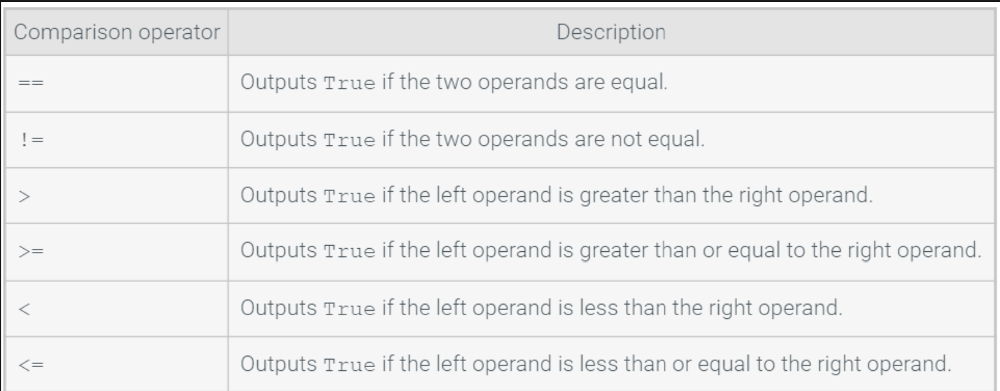
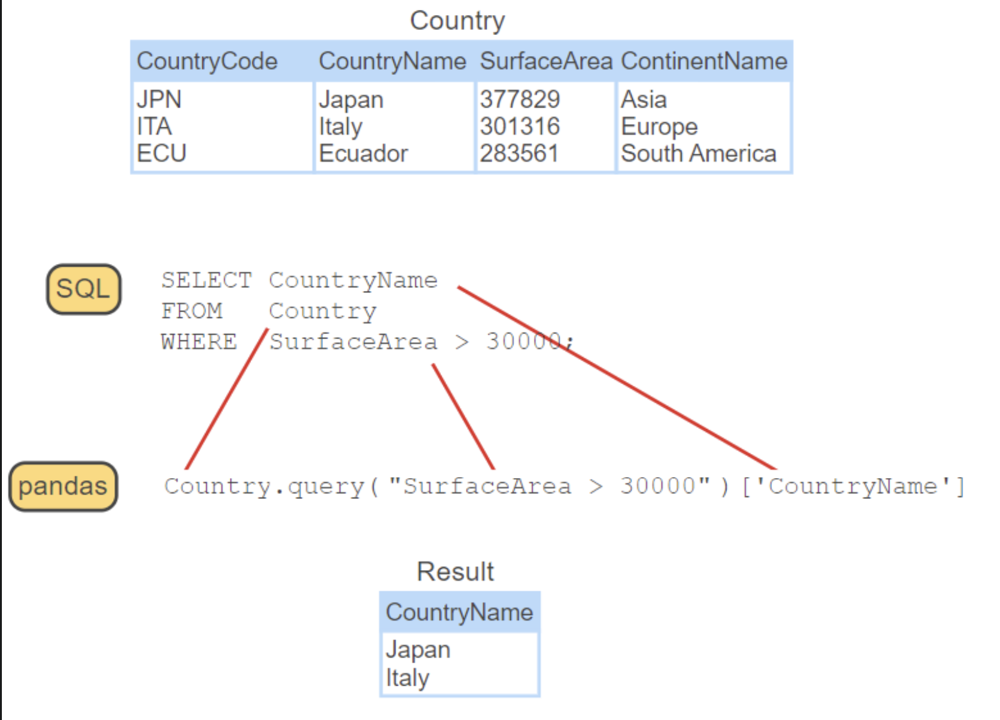

# Translating Queries from SQL to `pandas`

## `DataFrame.query()`

- a `pandas` method that allows users to write SQL-like queries
	- queries in `pandas` must contain Boolean expressions
	- all instances in the dataframe that are `True` are returned by the query
	- queries in `pandas` refer to features as text within a string
		- Ex: `DataFrame.query("Feature == 0")` will return all instances in the dataset where `Feature` is exactly `0`
		- `pandas` comparison operators can be used within `.query()` as can logical operators
		- `.query()` also recognizes English language logical operators "and", "or", and "not"

